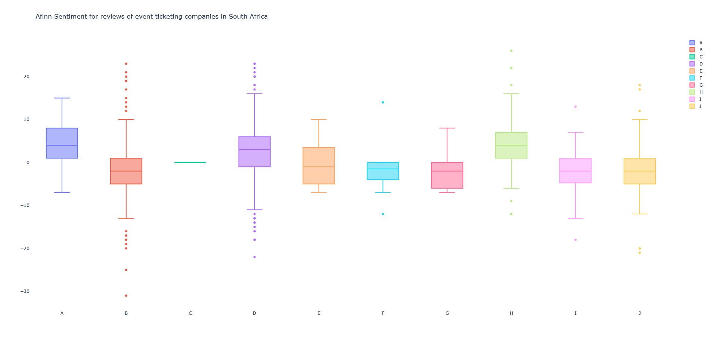

# About the project

In this project I scraped reviews from [Hello Peter](https://www.hellopeter.com/) for several event ticketing companies in South Africa. I then applied Natural Language Processing (NLP) techniques on the reviews and produced three blog posts for [Vibin](https://vibin.co.za), an event ticketing platform in South Africa. Here are the links to the articles:

1.  [Unveiling Insights through Topic Modeling: Analyzing Event Ticketing Reviews in South Africa](https://vibin.co.za/blog/unveiling-insights-through-topic-modeling-analyzing-event-ticketing-reviews-in-south-africa.html)

2. [Exploring the Power of Emotional Analysis in Event Ticketing Reviews in South Africa](https://vibin.co.za/blog/exploring-the-power-of-emotional-analysis-in-event-ticketing-reviews-in-south-africa.html)

3. [Analyzing Sentiments in Reviews of Event Ticketing Companies in South Africa](https://vibin.co.za/blog/analyzing-sentiments-in-reviews-of-event-ticketing-companies-in-south-africa.html)

## Sentiment Analysis

Here are the results from applying sentiment analysis on the reviews.

For the AFINN sentiment based here are the results:

For the NRC Sentiment here are the results:

For the VADER based sentiment:

## Emotional Analysis

In most cases, analysts end with sentiment analysis when looking at customer reviews. In this case, I decided to go further and apply emotional analysis. I used the NRC emotions Lexicon to associate each words with an emotion, also known as an affect. Here are the results:

## Topic Modeling

Topic modeling is an advanced technique in NLP to discover the topics within a corpus. A topic is known as a distribution of words. I applied three different methods for topic
modeling, namely: 1. Bertopic, 2. Top2Vec, 3. LDA. It was only Bertopic that delivered topics that could be interpreted. See image below. 

